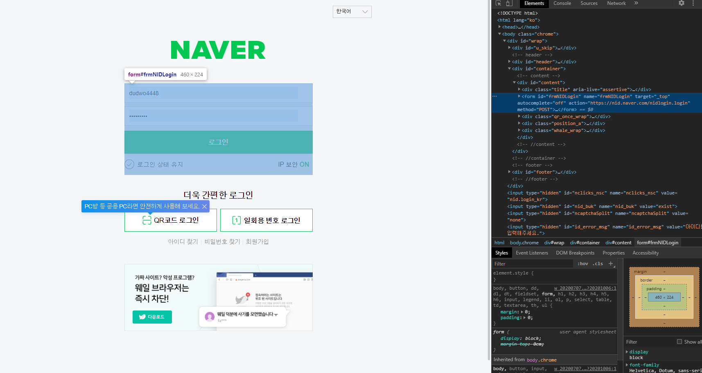

## Form?
HTML 에서 `<form>`이라는 요소는 사용자에게서 얻은 정보를 모으기 위해서 사용된다. 예를 들어서 네이버에 접속을 하시게 되면 아이디와 비밀번호를 입력하는 창이 있다. 사용자한테서 입력하는 그 공간이 `<form>`으로 이루어져있다고 생각하시면 된다.

>폼, 입력 폼은 웹 프로그래밍의 기술의 하나이다. 클라이언트가 정보를 입력 · 선택하고, 웹 서버 등의 폼을 처리하는 에이전트로 제출하기 위한 기구이다.

```html 
<body>
    <form action="" method="" enctype="">
        <input type="id" name="id" />
        <input type="submit" />
    </form>
</body>
```
HTML의 form은 위의 코드와 같이 클라이언트에게 보낼 `<input/>`를 감싸는 형태로 작성된다.

form 태그에는 `action`,`method`,`enctype` 속성이 있다.
- `action` 은 데이터를 보낼 url 주소를 정한다.
- `method` 는 GET,POST,PUT 등 어떤 방식으로 데이터를 보낼지 정한다.
- `enctype` 은 데이터의 인코딩 방식을 정한다.


이렇게 form은 자신의 태그 안에 있는 input 태그들의 정보들을 모아 action에 설정된 url로 method에 정의된 방식으로 데이터를 enctype에 따라 보내게 된다.
위 코드는 첫번째 input인 id에 적은 값을 url로 보낸다. 하지만 action에 url을 지정하지 않았기에 아무일도 일어나지 않는다.

## 유효성검사

>웹 표준은 월드 와이드 웹의 측면을 서술하고 정의하는 공식 표준이나 다른 기술 규격을 가리키는 일반적인 용어이다. 최근에 이 용어는 웹 사이트를 작성하는 데 중요도가 높아지고 있으며 웹 디자인, 개발과 관계가 있다. - [위키백과]

즉 웹 표준을 지킨다는 것은 어느 브라우저를 사용하는지 여부에 상관없이 그 웹페이지가 똑같이 보이고 정상적으로 작동한다는 것이다.

> http://validator.w3.org/ 여기서 웹 유효성 검사를 할 수 있다.

<hr>
### 참고
<a href="https://ko.wikipedia.org/wiki/%EC%9B%B9_%ED%91%9C%EC%A4%80">웹 표준 [위기백과]</a>

<a href="https://velog.io/@goban/HTML%ED%8F%BC%EA%B3%BC-%EC%9C%A0%ED%9A%A8%EC%84%B1%EA%B2%80%EC%82%AC">웹 HTML폼과 유효성검사 [이명환]</a>
<br>
<br>
<br>