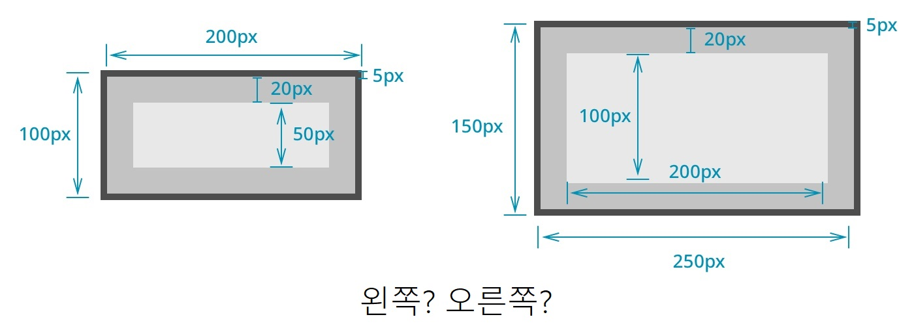
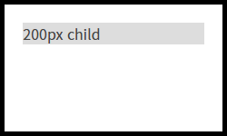
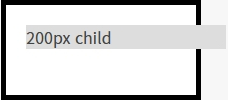
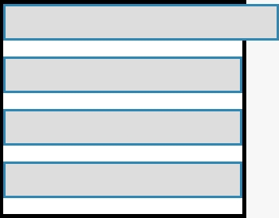

# CSS 속성
1. [width, height](#width,-height)
2. [margin, padding ](#margin,-padding )

<hr>

## width, height
`width`와 `height` 속성은 각각 가로 길이, 세로 길이를 의미한다.

값을 정의 할때는 `100px` 처럼 숫자 뒤에 단위를 표시하여 작성한다.

예시 코드

```css
div { 
    width: 100px; height: 60px 
}
```

## margin, padding 

`margin`과 `padding` 속성은 각각 바깥쪽 여백, 안쪽 여백을 의미한다.
`width`, `height` 속성과 마찬가지로 숫자 뒤에 단위를 표시하여 적는다.

`margin`과 `padding`는 `border` 을 경계로 나뉜다.

#### 방향
방향마다 여백을 다르게 설정할 수 있습니다.

- margin: 20px 같은 표현은 상하좌우 모두 20px을 의미한다.
- margin: 30px 10px은 상하 30px, 좌우 10px을 의미한다.
- margin: 30px 10px 20px 50px은 위 30px, 오른쪽 10px, 아래 20px, 왼쪽 50px을 의미한다.
- margin: 30px 10px 40px은 위 30px, 좌우 10px, 아래 40px을 의미한다.
즉 방향의 위부터 시계방향으로 회전하여 위 오른쪽 아래 왼쪽 순서로 설정한다.

> margin과 padding은 top, bottom, left, right 로 상 하 좌 우를 각각 지정할 수 있다.

예시 코드
```css
#box{ 
    margin: 10px;
    padding: 20px ;
}
.Container{ 
    margin-top: 15px;
    padding-left: 50px;
    padding-right: 40px;
}
```

### box-sizing
`CSS`에서 `width`와 `height`를 계산하는 방법은 꽤 독특합하다. `width: 200px` 이고 `height: 100px`, `padding: 20px`, `border: 5px solid black`인 요소는 화면상에 어떻게 나타날까?



### content-box
정답은 오른쪽 처럼 그려지게 된다.
`width`를 `200px`로 설정했다고 할지라도 전체 너비가 `200px`이 되는 것이 아닌, 여기에 `padding`과 `border-width`가 더해져서 그려지게 된다.

이는 계산 방법을 `content-box`라고 하며, `box-sizing` 속성을 `content-box`로 주게 되면 이와 같이 계산하게 됩니다. 기본적으로 `CSS`에서 위처럼 요소를 렌더링하는 이유는 `box-sizing` 속성의 기본 값이 `content-box`이기 때문입니다.

예시 코드
```html
<style>
.content-box {
    box-sizing: content-box;
    width: 200px;
    height: 100px;
    padding: 20px;
    border: 5px solid black;
    background-color: white;
}
.content-box .child{
    width: 200px;
    background-color: #ddd;
}
</style>
<div class="content-box">
    <div class="child">200px child</div>
</div>
```
출력 결과


### border-box
위 예시에서 왼쪽처럼 요소를 렌더링하고 싶다면 `box-sizing` 속성을 `border-box`로 주면 된다.

예시 코드
```html
<style>
.border-box {
    box-sizing: border-box;
    width: 200px;
    height: 100px;
    padding: 20px;
    border: 5px solid black;
    background-color: white;
}
.border-box .child{
    width: 200px;
    background-color: #ddd;
}
</style>
<div class="border-box">
    <div class="child">200px child</div>
</div>
```
출력 결과


### content-box에서 width:100%일 때의 문제
`CSS`에서 width 속성을 100%로 주면 부모의 `width` 만큼 너비가 설정된다. 
그러나 `content-box`일 때 `width: 100%`에 이어 `padding`이나 `border`를 주게 될 경우 부모의 영역을 초과해서 너비가 정해지는 문제가 생길 수 있다.

이런 문제를 해결하기 위해서는 `box-sizing`을 `border-bo`x로 설정하거나 `width`를 `auto`로 설정하여 해결할 수 있다. `width`의 기본 값은 `auto`이므로 `width`를 아예 적어주지 않아도 정상적으로 동작한다.

예제
```html
<style>
.container1 {
    width: 300px;
    border: 5px solid black;
    background-color: white;
}
.container1 > div {
    padding: 20px;
    background-color: #ddd;
    margin-bottom: 20px;
    border: 3px solid #2e88b5;
}
.container1 .child1{
    width: 100%; /* 문제발생 */
}
.container1 .child2{
    width: 100%;
    box-sizing: border-box; /* 해결방법 1 */
}
.container1 .child3{
    width: auto; /* 해결방법 2 */
}
.container1 .child4{
    /* width의 기본 값: auto */
}
</style>
<div class="container1">
    <div class="child1"></div>
    <div class="child2"></div>
    <div class="child3"></div>
    <div class="child4"></div>
</div>
```

출력 결과


### color
color 속성은 단어 뜻대로 색상, 정확히는 글자의 색상을 의미한다.

- red, blue등 이미 정의된 색
- #000, #FFFFFF 등의 16진수 색상 코드
- rgb(255, 255, 255) 등의 rgb 색상
- rgba(200, 100, 150, 0.5) 등의 알파(투명도)가 적용된 rgba 색상

`color` 속성은 위 목록등의 값을 사용할 수 있으며, 기본값은 `inherit`으로 부모의 색상을 가져온다.

예시 코드
```css
#text1 { 
    color: red; 
}
#text2 { 
    color: #0A0; 
}
#text3 { 
    color: rgb(0, 0, 150); 
}
#text4 { 
    color: rgba(30, 150, 100, 0.5); 
}
```

### font

font 속성은 글자의 폰트를 정의하는 속성인데, 여러 기능을 동시에 가지고 있는 속성이기도 하다.
정확히 말하면 6개의 세부적인 글꼴 관련 속성을 font라는 하나의 속성에 한번에 쓸 수 있다.

<table>
  <tr>
    <td>font-style</td><td>이탤릭체 등의 글꼴의 스타일 지정</td>
  </tr>
  <tr>
    <td>font-weight</td><td>글자 두께</td>
  </tr>
  <tr>
    <td>font-variant</td><td>글꼴 변형 (소문자를 대문자로 바꾸는 등의)</td>
  </tr>
  <tr>
    <td>font-size</td><td>글자 크기</td>
  </tr>
  <tr>
    <td>line-height</td><td>줄 간격</td>
  </tr>
  <tr>
    <td>font-family</td><td>글꼴 (굴림, 돋움, …)</td>
  </tr>
</table>

font 속성은 다음과 같은 순서로 세부 속성을 한번에 기술한다.

```
font: font-style font-variant font-weight font-size/line-height font-family
```

#### font-style
글꼴의 스타일로, 주로 이탤릭체(기울여 표시)를 설정하기 위해 사용한다.

- normal: 기본
- italic: 이탤릭체
#### font-weight
글꼴의 두께로, 미리 정의된 단어나 `100 ~ 900` 사이의 숫자를 통해 설정한다.
기본값은 `normal` 이다.

- 100: lighter
- 200
- 300
- 400: normal
- 500
- 600
- 700: bold
- 800
- 900: bolder
#### font-size
글자 크기로, `<font>` 태그의 size 속성과 효과가 같다.
(HTML5 부터 `<font>` 태그 사용은 권장되지 않으며, CSS를 사용해야 합니다)

`px`, `px`, `em`, 등의 단위와 `small`, `big` 등의 상수 크기를 사용할 수 있다.
(일반 웹 페이지에서는 px 사용)

#### font-family
글꼴 종류로, `<font>` 태그의 face 속성과 효과가 같다.
쉼표(,)로 여러 글꼴을 등록 할 수 있는데, 이때 맨 앞에 있는 글꼴을 우선으로 적용시키며, 맨 앞에 있는 글꼴이 사용자의 컴퓨터에 없을 때 그 다음 글꼴을 사용하게 된다.

```css
.box1 {
	font-size: 20px;
	font-family: 나눔고딕,NanumGothic,돋움,Dotum;
}
.box1 .title { 
    font-weight: bold 
}
.ex1 { 
    font: 15px NanumGothic, sans-serif 
}
.ex2 { 
    font: italic bold 12px/30px Dotum, sans-serif 
}
```