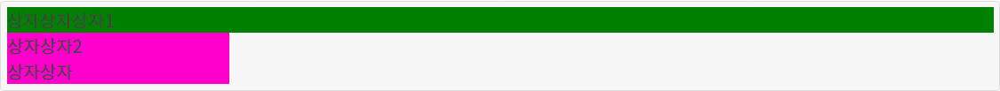
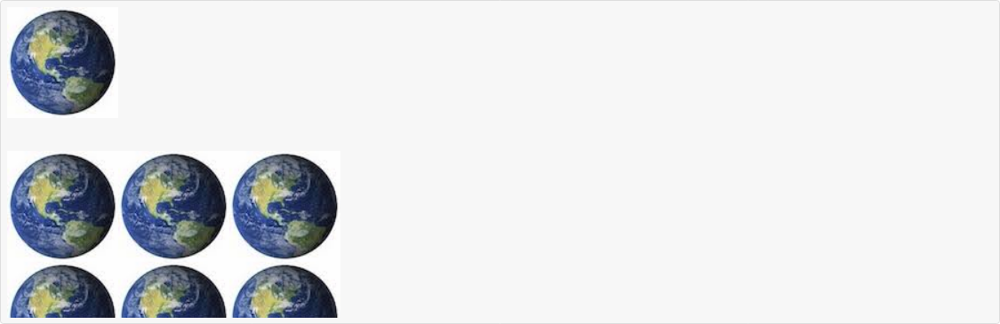
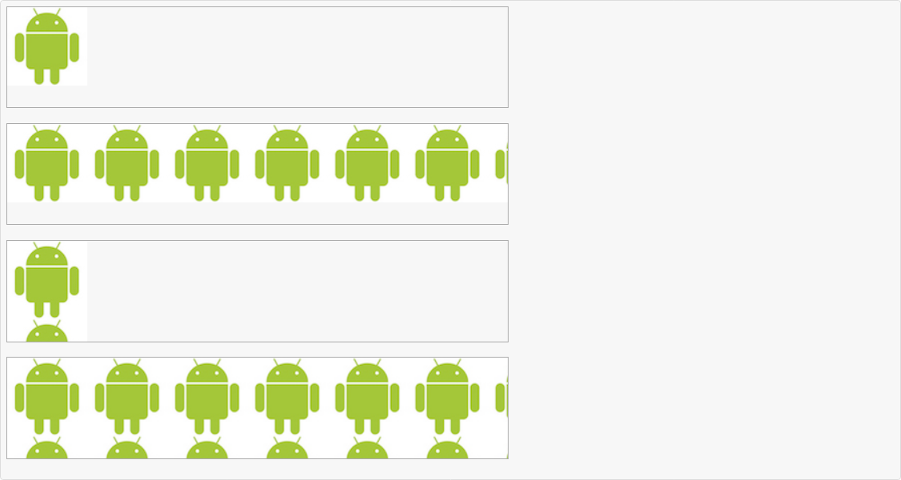
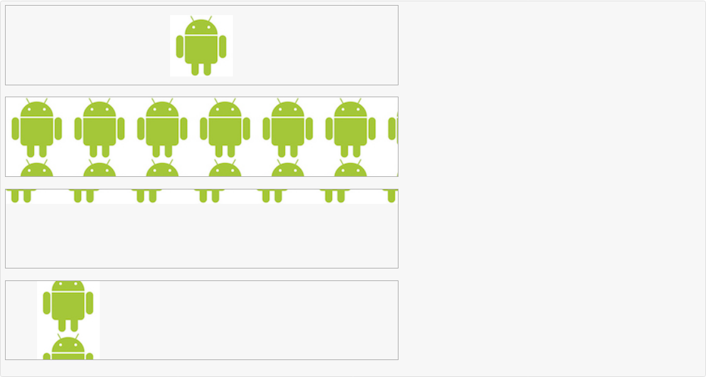

<a href="./attribute1.md">이전 파일</a>
<a href="./attribute3.md">다음 파일</a>

## background

`background` 속성은 태그의 배경을 지정하는 속성으로, `font `속성과 비슷하게 세부적인 속성들을 한번에 쓸 수 있는 속성이다.

- `background-color`: 배경 색
- `background-image`: 배경 이미지
- `background-repeat`: 배경 이미지 반복 여부
- `background-position`: 배경 이미지 위치

### background-color
배경색을 의미하며, 값은 `color` 속성의 포맷을 사용한다.
>태그의 크기가 없을 경우 배경색은 표기되지 않는다.

예시 코드
``` html
<style>
	#box1{
         background-color: green; 
    }
	#box2{ 
        background-color: #FF00CC; 
        width: 200px ;
    }
</style>
<div id="box1">
    상자1
</div>
<div id="box2">
    상자2
    <br>
    상자2
</div>
```

출력 결과


### background-image
배경 이미지를 설정하며, 주로 이미지 경로를 지정하는 방식으로 사용합니다.
경로는 `background-image: url("이미지 경로")` 처럼 작성합니다.

>컨테이너의 크기와 상관없이 삽입된 `background-image`의 크기는 컨테이너에 맞춰 늘어나거나 줄어들지 않고 그대로 표시되며, 이미지 보다 컨테이너가 더 크다면 이미지는 반복되어 표시되게 된다.

예시 코드
```html
<style>
	#box1 {
		width: 100px;
		height: 100px;
		background-image: url("/images/attach/earth.jpg");
	}
	#box2{
		width: 300px;
		height: 150px;
		margin-top: 30px;
		background-image: url("/images/attach/earth.jpg");
	}
</style>
<div id="box1"></div>
<div id="box2"></div>
```

출력 결과


### background-repeat
`background-image`로 컨테이너보다 작은 이미지를 적용하면 이미지가 반복되어 출력된다. 이때 `background-repeat` 속성을 사용하면 반복여부를 지정 할 수 있다.

예시코드
```html
<style>
	.abox{
		width: 500px;
		height: 100px;
		margin-bottom: 15px;
		background-image: url("./안드로이드 이미지");
		border: 1px solid #AAA;
	}
	#box1{ 
        background-repeat: no-repeat;
    }
	#box2{ 
        background-repeat: repeat-x; 
    }
	#box3{ 
        background-repeat: repeat-y; 
    }
	#box4{ 
        background-repeat: repeat; 
    }
</style>

<div id="box1" class="abox"></div>
<div id="box2" class="abox"></div>
<div id="box3" class="abox"></div>
<div id="box4" class="abox"></div>
```

출력 결과


### background-position
일반적으로 `background-image` 는 왼쪽 위부터 이미지를 출력한다. `background-position` 속성을 사용하면 이미지의 좌표를 수정 할 수 있게 된다.

`margin`, `padding` 속성에서 지정했던 것과 비슷하게 띄어쓰기를 기준으로 `x좌표`, `y좌표`를 지정한다. 픽셀 뿐만 아니라 `left`, `top`, `center`, `bottom`, `right` 등의 상수도 쓸 수 있다.

예시코드
```html
<style>
	.abox{
		width: 500px;
		height: 100px;
		margin-bottom: 15px;
		background-image: url("./안드로이드 이미지");
		border: 1px solid #AAA;
	}
	#box1{ 
        background-position:center center; background-repeat: no-repeat;
    }
	#box2{ 
        background-position:30px right; 
        background-repeat: repeat; 
    }
	#box3{ 
        background-position:-100px -60px; 
        background-repeat: repeat-x;
    }
	#box4{ 
        background-position:40px -90px; 
        background-repeat: repeat-y; 
    }
</style>

<div id="box1" class="abox"></div>
<div id="box2" class="abox"></div>
<div id="box3" class="abox"></div>
<div id="box4" class="abox"></div>
```

출력 결과


<hr>

## border

`border` 속성은 태그의 테두리를 설정하는 속성으로, `background` 속성과 비슷하게 세부적인 속성들을 한번에 쓸 수 있는 속성이다. width - style - color의 순서로 사용한다.

#### border-width
테두리의 두께로, 주로 px 단위를 사용한다.

#### border-style
테두리의 스타일로 실선, 점선, 이중선 등의 옵션이 존재한다.

#### border-color
테두리의 색상으로, 값은 color 속성의 포맷을 사용한다.

예시코드
```html
<style>
	.border-styles > p{
		margin: 2px 0;
		padding: 1px 3px;
		border-width: 2px;
		border-color: #aaa;
	}
</style>
<div class="border-styles">
	<p style="border-style: solid">solid</p>
	<p style="border-style: dotted">dotted</p>
	<p style="border-style: dashed">dashed</p>
	<p style="border-style: double">double</p>
	<p style="border-style: groove">groove</p>
	<p style="border-style: ridge">ridge</p>
	<p style="border-style: inset">inset</p>
	<p style="border-style: outset">outset</p>
</div>
```

### 방향
테두리의 특정 방향만 따로 설정할 수도 있다.

- `border-top`
- `border-bottom`
- `border-left`
- `border-right`
- `border-bottom-color`

처럼 방향과 색,두께,스타일을 따로 설정할 수도 있다.

예시 코드

```css
#box{
	border: 4px dotted green;
	border-bottom: 5px solid blue;
}
```

<hr>
## border-radius

`border-radius` 속성은 요소의 테두리를 둥글게 만들어준다. `px`단위와 `%` 단위를 사용할 수 있으며, `border` 속성 없이도 사용할 수 있다.

총 4개의 모서리를 각각 다른 값으로도 줄 수 있습니다. `margin` 및 `padding` 속성 처럼 4개의 값을 띄워쓰면 왼쪽-위 부터 시계 방향으로 각자 다른 값을 지정할 수 있다.

예시 코드

```css
#box{
	border-radius: 5px;
	border-radius: 1px 2px 3px 4px;
}
```
<hr>
## visibility

`visibility` 속성은 태그의 가시성을 결정한다.

아래의 4가지 값을 가지며, 기본 값은 `inherit` 이다.

- `visible`: 보임
- `hidden`: 숨김 (자신의 영역은 계속 차지)
- `collapse`: 겹치도록 지정(테이블의 행과 열 요소만 지정할 수 있으며, 그 외 요소의 지정하면 `hidden`으로 해석)
- `inherit`: 부모 요소의 값을 상속

<hr>

## display

display 속성은 요소를 어떻게 보여줄지를 결정한다.
주로 4가지 속성값이 쓰이는데, 태그마다 기본값이 다르다.

- `none` : 보이지 않음
- `block` : 블록 박스
- `inline` : 인라인 박스
- `inline-block` : block과 inline의 중간 형태

#### none

요소를 렌더링하지 않도록 설정합니다. visibility 속성을 hidden으로 설정한 것과 달리, 영역도 차지하지 않는다.

#### block
`div`, `p`, `h`, `li` 등이 이에 해당된다.

기본적으로 가로 영역을 모두 채우며, `block` 요소 다음에 등장하는 태그는 줄바꿈이 된 것처럼 보인다. 이는 `word` 같은 문서에서 문단을 표시할 때, 한 문단이 끝난 뒤에 나타나는 요소는 항상 다음 줄에 표시되던 것과 비슷한 맥락이다.

`width`, `height` 속성을 지정 할 수 있으며, `block` 요소 뒤에 등장하는 태그가 그 이전 `block` 요소에 오른쪽에 배치될 수 있어도 항상 다음 줄에 렌더링된다.

#### inline
`span`, `b`, `i`, `a` 등이 이에 해당된다.

`block` 과 달리 줄 바꿈이 되지 않고, `width`와 `height`를지정 할 수 없다. `word` 같은 문서에서 볼드, 이탤릭, 색상, 밑줄 등 글자나 문장에 효과를 주기 위해 존재하는 단위라고 할 수 있다. 문서에서 특정 부분에 색상을 입힌다고 다음에 나오는 글이 줄바꿈 되지 않듯이 `inline` 요소 뒤에 나오는 태그 또한 줄바꿈 되지 않고 바로 오른쪽에 표시된다.

#### inline-block
`block`과 `inline`의 중간 형태라고 볼 수 있는데, 줄 바꿈이 되지 않지만 크기를 지정 할 수 있다.
> Internet Explorer 7 이하에서는 사용할 수 없다.
<hr>

<a href="./attribute1.md">이전 파일</a>
<a href="./attribute3.md">다음 파일</a>