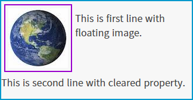
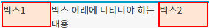

<a href="./attribute2.md">이전 파일</a>

## clear

`float` 속성을 통해 태그를 부유시킨 이후 문서의 흐름을 제거하기 위해 쓰인다.
방향에 따라 3가지 속성을 사용할 수 있다.

 `left`: 좌측 부유 제거
 `right`: 우측 부유 제거
 `both`: 양쪽 모두 제거

예시 코드
```html
<html>
<head>
<style>
	.float-container{ 
        width: 320px; 
        border: 2px solid #09c; 
    }
	.float-container img{ 
        float: left;
        margin: 5px; 
        padding: 5px; 
        border: 2px solid #90C; 
    }
</style>
</head>
<body>
	<div class="float-container">
		
		<p>This is first line with floating image.</p>
		<p style="clear: both">This is second line with cleared property.</p>
	</div>
</body>
</html>
```

출력결과

<hr>

### 레이아웃에서의 clear
`float` 속성이 레이아웃에서 많이 사용한다고 하였는데, `clear`속성도 `float`를 레이아웃에서 사용하며 발생되는 문제를 해결하기 위해 많이 사용된다.

`float` 속성을 적용한 태그는 붕 뜨며 정상적인 요소로 처리가 안되기 때문에
아래에 나타나야 하는 내용이 부유된 태그의 중간에 나타나는 문제 및 상위 태그의 높이가 없어지는 문제 등이 발생하게 된다.

예시 코드 1
```html
<style>
	.box-container{
		width: 350px;
		border: 2px solid #09c;
		background-color: #d7f5ff;
	}
	.box-container .box{
		width: 80px;
		height: 40px;
		border: 2px solid red;
		background-color: #ffe7d5;
	}
</style>
<div class="box-container">
	<div class="box" style="float: left">박스1</div>
	<div class="box" style="float: right">박스2</div>
</div>
<div>박스 아래에 나타나야 하는 내용</div>
```

출력 결과


예시 코드 2
```html
<style>
	/** 위 코드와 스타일 동일함 **/
</style>
<div class="box-container">
	<div class="box" style="float: left">박스1</div>
	<div class="box" style="float: right">박스2</div>
	<div style="clear: both"></div>
</div>
<div>박스 아래에 나타나야 하는 내용</div>
```

출력 결과


### after 가상선택자와 clear
`clear` 해주기 위해서는 `float`된 요소 다음에 `clear`하는 태그를 따로 삽입해야 하는 불편함이 있다.
이때 가상 클래스 선택자를 이용하면 이 문제를 해결할 수 있다.

부유를 제거하고 싶은 컨테이너에 다음 클래스를 적용시키면 문제가 해결된다.

```css
.clearfix:after{ content: ""; display: block; clear: both }
```

## 레이아웃 구성

`CSS`로 레이아웃을 구성하는 방법은 매우 많지만, 여러 상황에 맞게 적절한 방법을 사용해야 한다. 예를 들어 `flex`는 가장 진보된 기술이지만, 오래된 브라우저가 지원하지 않기에 함부로 사용하기 어렵다. 또한 여러분의 환경에서 알맞게 보이더라도, 반응형과 해상도에 대한 고려를 잘 하지 않았더라면 모바일이나 태블릿, 혹은 다른 사람의 PC에서는 레이아웃이 깨져 보일 수도 있다.


<a href="./attribute2.md">이전 파일</a>