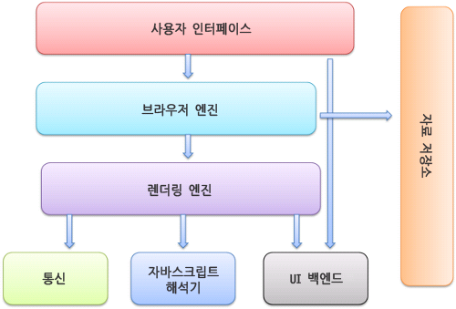

## Browsers?
브라우저 또는 웹 브라우저는 웹 서버에서 이동하며 쌍방향으로 통신하고 HTML 문서나 파일을 출력하는 그래픽 사용자 인터페이스 기반의 응용 소프트웨어이다. 웹 브라우저는 대표적인 HTTP 사용자 에이전트의 하나이기도 하다.

## 브라우저의 주요 기능

브라우저의 주요 기능은 사용자가 선택한 자원을 서버에 요청하고 브라우저에 표시하는 것이다. 자원은 보통 HTML 문서지만 PDF나 이미지 또는 다른 형태일 수 있다. 자원의 주소는 URI에 의해 정해진다.

브라우저는 HTML과 CSS 명세에 따라 HTML 파일을 해석해서 표시하는데 이 명세는 웹 표준화 기구인 W3C에서 정한다.

브라우저의 사용자 인터페이스는 서로 닮아 있는데 다음과 같은 요소들이 일반적이다.

> * URI를 입력할 수 있는 주소 표시 줄
> * 이전 버튼과 다음 버튼
> * 북마크
> * 새로 고침 버튼과 현재 문서의 로드를 중단할 수 있는 정지 버튼
> * 홈 버튼

브라우저의 사용자 인터페이스는 표준 명세가 없음에도 불구하고 수 년간 서로의 장점을 모방하면서 현재에 이르게 되었다. HTML5 명세는 주소 표시줄, 상태 표시줄, 도구 모음과 같은 일반적인 요소를 제외하고 브라우저의 필수 UI를 정의하지 않았다. 물론 파이어폭스의 다운로드 관리자와 같이 브라우저에 특화된 기능도 있다.

## 브라우저의 기본 구조

>1. 사용자 인터페이스 - 주소 표시줄, 이전/다음 버튼, 북마크 메뉴 등. 요청한 페이지를 보여주는 창을 제외한 나머지 모든 부분이다.
>2. 브라우저 엔진 - 사용자 인터페이스와 렌더링 엔진 사이의 동작을 제어.
>3. 렌더링 엔진 - 요청한 콘텐츠를 표시. 예를 들어 HTML을 요청하면 HTML과 CSS를 파싱하여 화면에 표시함.
>4. 통신 - HTTP 요청과 같은 네트워크 호출에 사용됨. 이것은 플랫폼 독립적인 인터페이스이고 각 플랫폼 하부에서 실행됨.
>5. UI 백엔드 - 콤보 박스와 창 같은 기본적인 장치를 그림. 플랫폼에서 명시하지 않은 일반적인 인터페이스로서, OS 사용자 인터페이스 체계를 사용.
>6. 자바스크립트 해석기 - 자바스크립트 코드를 해석하고 실행.
>7. 자료 저장소 - 이 부분은 자료를 저장하는 계층이다. 쿠키를 저장하는 것과 같이 모든 종류의 자원을 하드 디스크에 저장할 필요가 있다.

## 렌더링 엔진

>렌더링 엔진의 역할은 요청 받은 내용을 브라우저 화면에 HTML 및 XML 문서와 이미지를 표시하는 일이다.

### 동작 과정

1. HTML 문서를 파싱하고 `content-tree` 내부에서 태그를 DOM 노드로 변환
2. 외부 CSS 파일과 함께 포함된 스타일 요소 파싱
3. 스타일 정보와 HTML 표시 규칙은 `렌더 트리`라고 부르는 또 다른 트리를 생성
> `렌더 트리` : 색상 또는 면적과 같은 시각적 속성이 있는 사각형을 포함하고 있는데 정해진 순서대로 화면에 표시
4. `렌더 트리` 배치
5. UI 백엔드에서 렌더 트리의 각 노드를 가로지르며 형상을 만들어 내는 그리기

### 동작 과정 예

> **웹킷(Webkit)의 동작 과정**
> 

 

> **게코(Gecko)의 동작 과정**
> 

웹킷과 게코가 용어를 약간 다르게 사용하고 있지만 동작 과정은 기본적으로 동일하다는 것을 위 그림에서 알 수 있다.

### 참고

<a href="https://d2.naver.com/helloworld/59361">브라우저는 어떻게 동작하는가? [NAVER D2]</a>

<a href="https://www.youtube.com/watch?v=cCbAJY1riDc">웹 브라우저의 기본 원리 [두원이 Doowonee YouTube]</a>
 
 
 
