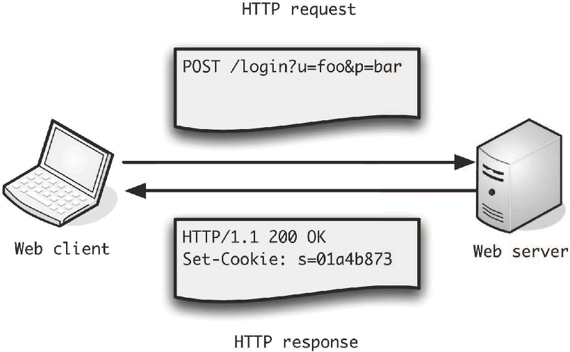

## HTTP란?
HTTP(HyperText Transfer Protocol)는 HTML 문서와 같은 리소스들을 가져올 수 있도록 해주는 프로토콜이다. 웹에서 이루어지는 모든 데이터 교환의 기초이며, 클라이언트-서버 프로토콜이기도 하다. 웹 브라우저와 웹 서버간의 커뮤니케이션을위해 디자인되었지만, 다른 목적으로도 사용될 수 있다.

## HTTP 동작
클라이언트 즉, 사용자가 브라우저를 통해서 어떠한 서비스를 url을 통하거나 다른 것을 통해서 요청(request)을 하면 서버에서는 해당 요청사항에 맞는 결과를 찾아서 사용자에게 응답(response)하는 형태로 동작한다.

> - 요청 : client -> server
> - 응답 : server -> client

 

1. 클라이언트가 서버에 요청을 보내면
2. 서버는 그에 맞는 응답 결과를 돌려주고, 
3. 클라이언트는 사용자에게 서버로부터 응답받은 결과를 보여주는 것

## HTTP의 특징
> - HTTP 메시지는 HTTP 서버와 HTTP 클라이언트에 의해 해석이 된다.
> - TCP/ IP를 이용하는 응용 프로토콜이다.
> - HTTP는 연결 상태를 유지하지 않는 비연결성 프로토콜이다.
> (이러한 단점을 해결하기 위해 Cookie와 Session이 등장하였다.)
> - HTTP는 연결을 유지하지 않는 프로토콜이기 때문에 요청/응답(request/response) 방식으로 동작한다.

##예시로 알아보는 HTTP
**`서버`** : 어떠한 자료에 대한 접근을 관리하는 네트워크 상의 시스템 (요청에 대한 응답을 보내준다.)
**`클라이언트`** : 그 자료에 접근할 수 있는 프로그램

클라이언트 프로그램에서 사용자가 회원가입을 시도하게 되면, 서버로 회원정보를 보내게 되고 서버는 회원 정보를 저장해주기도 한다. 이 과정에서 클라이언트와 서버 간의 교류가 HTTP라는 규약을 이용하여 발생하게 된다.